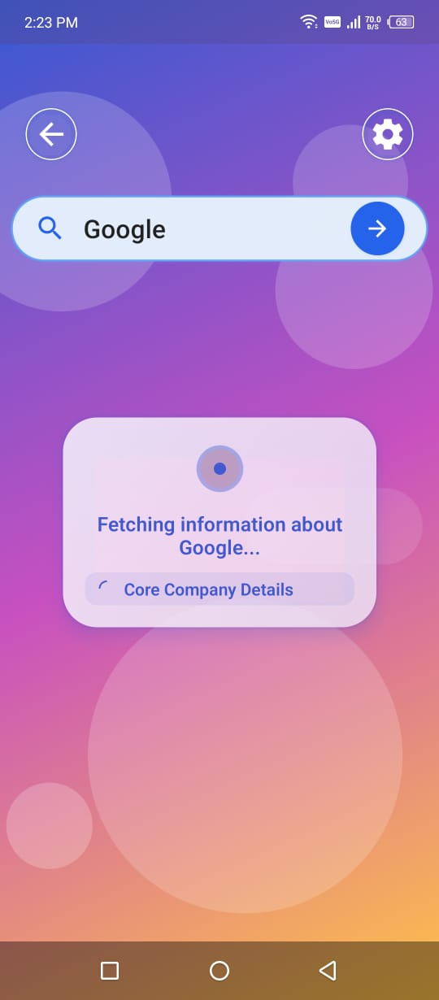
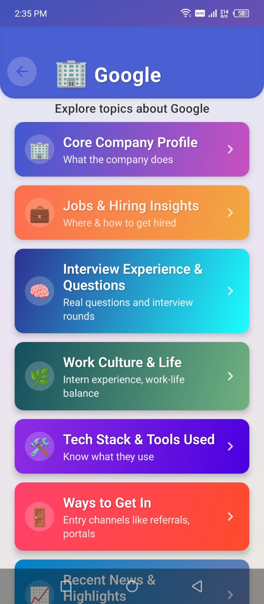

<!-- HEADER BANNER -->
<p align="center">  
  
</p>

<h1 align="center">📊 Insider – AI-Powered Company Analysis App</h1>

<p align="center">
  <b>Built with</b> ⚛️ React Native (Expo) • 🤖 OpenRouter API • 🎨 Native UI  
</p>

<p align="center">
  
  
  
  
</p>

---

## 🧠 Overview

**Insider** is your intelligent assistant for startup and company analysis. Whether you're an investor, entrepreneur, or analyst, Insider helps you decode any business with instant AI-powered insights — from funding history and SWOT to market positioning.

> ✅ Built for speed and clarity.  
> 🚀 Designed for native mobile.  
> 🧩 Powered by OpenRouter LLMs for deeper, contextual company intelligence.

---

## 🖼️ Screenshots

<p align="center">
  
  
  
</p>

---

## 🎯 Features

- 🔍 **Company Search**: Input company name and domain.
- 🧠 **AI Analysis**: Get SWOT, Market Landscape, Tech Stack, Funding, and more.
- 🧩 **Modular Output**: Contextual insights, easily readable.
- 🌐 **OpenRouter API**: LLM-based backend for smart querying.
- 🪄 **Native UI**: Smooth, responsive, clean design with animations.

---

## 🛠️ Built With

| Technology      | Description                                      |
|-----------------|--------------------------------------------------|
| Expo (React Native) | Fast native development experience         |
| OpenRouter API  | AI-based backend using custom LLM endpoints     |
| React Navigation| Smooth in-app navigation                        |
| NativeBase / Custom Components | Modern, scalable design system   |

---

## 🧬 App Structure
Insider

## ⚙️ Getting Started

```bash
# Clone the repo
git clone https://github.com/yourusername/insider-app.git
cd insider-app
```
```bash
# Install dependencies
npm install
```
```bash
# Start the project
npx expo start
```

## Important 
This app uses openrouter API key for its working
💡 You’ll need your OpenRouter API key 

---

## 🧠 Use Cases

Insider is crafted for users who need instant, reliable company analysis powered by AI. Perfect for:

| 🧑‍💼 Use Case              | 💡 How Insider Helps                                         |
|---------------------------|---------------------------------------------------------------|
| **Investors**             | Evaluate startups before funding, understand risk profiles    |
| **Entrepreneurs**         | Analyze competitors, identify market gaps                    |
| **Researchers/Analysts**  | Generate quick SWOT, funding history, and tech stack reviews |
| **Accelerators/Incubators**| Assess startup potential at scale                            |
| **Educators/Students**    | Learn company strategies and trends with AI-generated summaries |

---

## ⚙️ Tech Stack

The project is built with a modern mobile-native toolchain optimized for AI interaction.

| 🔧 Stack            | 🧩 Description                                      |
|---------------------|----------------------------------------------------|
| **React Native**    | Cross-platform mobile development with native feel |
| **Expo**            | Streamlined development & testing environment      |
| **OpenRouter API**  | AI engine that powers dynamic company analysis     |
| **React Navigation**| Easy navigation across app screens                 |
| **Fetch**   | API requests to OpenRouter                         |
| **NativeBase** *(optional)* | UI components & styling system               |

---

## 🧩 Project Highlights

✨ Some standout features that make Insider unique:

- **📈 Modular AI Insights**: Each company analysis is split into sections (SWOT, Funding, Market, Stack, etc.)
- **⚡ Fast & Lightweight**: Native performance with minimal lag
- **📱 Mobile-First Design**: Optimized UI for all screen sizes
- **🔐 Secure API Handling**: All keys loaded via `.env` and secure async handling
- **🔄 Realtime Requests**: Dynamically generated results from OpenRouter in seconds
- **🧑‍🎓 Educational Value**: Use as a learning tool for business model breakdowns

---

## 🙌 Credits

This project was ideated, developed, and polished by:

| Contributor        | Role                     |
|--------------------|--------------------------|
| **Bhuwan B**       | Founder, Developer, Designer |

### 👏 Special Thanks To:
- **OpenAI & Community**: For inspiration and foundational LLM research
- **Figma / Excalidraw**: For early UI wireframes
- **Expo Dev Tools**: For simplifying mobile testing and builds


## 📬 Contact

If you're interested in using Insider for your incubator, investment firm, or product suite, feel free to reach out:

- 💼 [LinkedIn](https://linkedin.com/in/bhuwanb23)
- 📧 Email: `bhuwanseervi4567@gmail.com`
- 🌐 Website: [yourwebsite.com](https://www.bhuwanb23.github.io/portfolio)

---

> Made with ❤️ & ⚛️ by Bhuwan B
